# Recurrent Neural Network (RNN) for Video Classification

Recurrent Neural Network (RNN) are deep learning models used for handling sequential data by keeping an internal memory.
It processes the sequence of data, step by step while leveraging information passing from one step to another.
It is ideal for data regarding time-series, text or speech data.

In this project, we will conduct an experiment on the mechanisms of Recurrent Neural Networks (RNN) for video classification, using _ResNet-34_ as a backbone model.\
We will conduct three different experiments to see the difference in performance between several different models:

1. Learning without Temporal Information (Average Pooling)
2. Learning with Temporal Information (LSTM)
3. Learning with Spatio-Temporal Information (ConvLSTM)

## Author

- [@peteralhachem](https://github.com/peteralhachem)

## Badges

## Dataset

We will use the _GTEA61_ dataset, a comprehensive egocentric video collection featuring 61 action sequences recorded from a first-person perspective, primarily focused on kitchen-related activities. Captured using wearable cameras, the dataset provides detailed recordings of individuals performing various tasks like food preparation and cooking, making it a valuable resource to our case in hand.

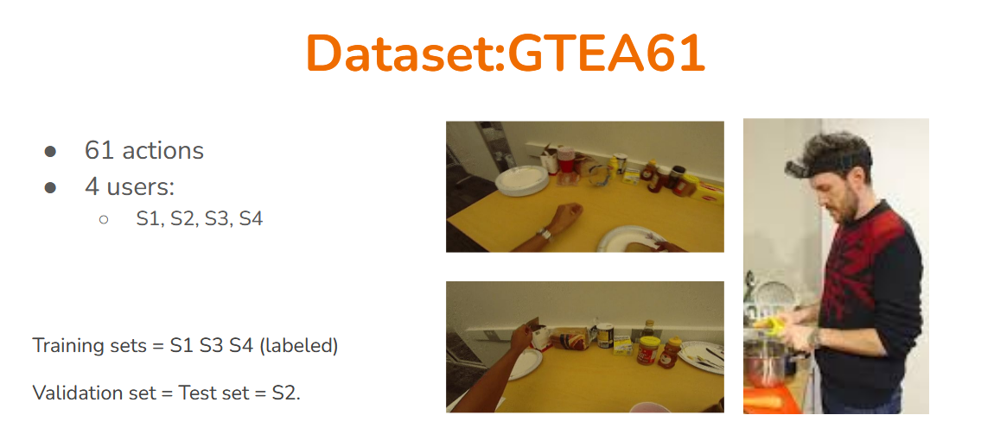

_Figure 1: GTEA61 Dataset_

## Network models

In the following section we will describe the three different network models that we will examine throught our experiment. As we have briefly introduced in the above section, we will examine, non-temporal, temporal and spatio-temporal models.

### 1. Non-Temporal Model (Average Pooling)

The first model we will examine is the non-temporal model, which is based on the concept of average pooling. This model will not take into account the temporal information of the video, and will simply average the features extracted from the frames of the video and using the fully connected layer, classify the videos with respect to the predicted actions. This model will be used as a baseline to compare the performance of the other models.

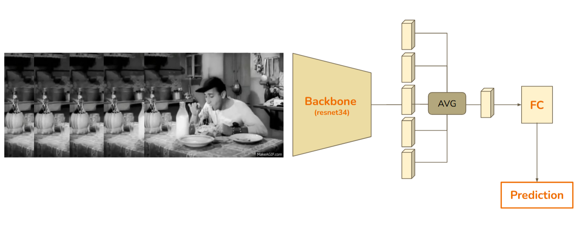

_Figure 2: Architecture of the non-temporal model_

### 2. Temporal Model (LSTM)

The second model we will examine is the temporal model, which is based on the concept of Long Short-Term Memory (LSTM): a type of recurrent neural network designed to overcome the vanishing gradient problem in traditional RNNs. Its unique cell structure includes input, forget, and output gates that dynamically control information flow, allowing selective memory preservation. Using sigmoid and tanh activations, LSTMs can selectively remember or forget information, enabling effective capture of long-term dependencies in sequential data by dynamically updating the cell state based on current input and previous memory. The LSTM layer will be followed by a fully connected layer to classify the videos with respect to the predicted actions.

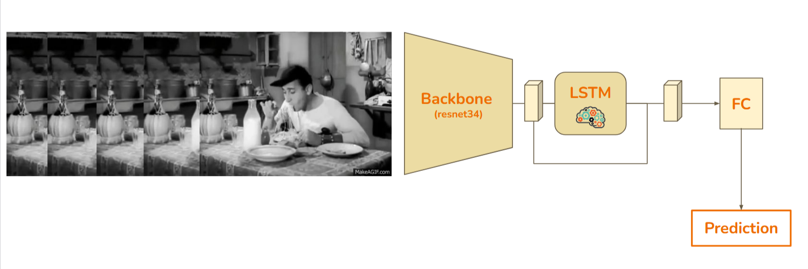

_Figure 3: Architecture of the temporal model_

Here we present an in-depth look at the LSTM cell, through the vairant components that it constitutes:

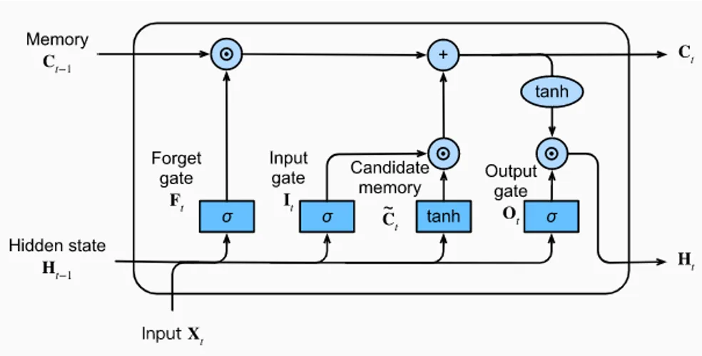

_Figure 4: LSTM Cell_

An in-depth look at the LSTM cell reveals the following components:

- **Forget gate:** The model chooses what to keep or forget in the LSTM cell state (i.e. memory) by outputting a value between 0 and 1 for each piece of information inside the cell.
- **Input gate:** The model inserts new information into the LSTM cell that render its presence important for its cell state. Using a _sigmoid_ function to determine what information to update and a _tanh_
  function to create a vector of new candidate values to be added to the cell state.
- **Output gate:** The model, in its current state, chooses what to pass to the hidden state as the current output value. It uses a _sigmoid_ function to determine what relevant information are to be used from the cell state (i.e. memory) to the
  current output value in the final hidden state.

### 3. Spatio-Temporal Model (ConvLSTM)

The third model we will examine is the spatio-temporal model, which is based on the concept of Convolutional LSTM (ConvLSTM): a type of recurrent neural network that combines the spatial convolutional structure of ConvNets with the temporal dynamics of LSTMs. ConvLSTMs are particularly effective for video data, as they can capture both spatial and temporal dependencies in a single model. The ConvLSTM layer will be followed by a fully connected layer to classify the videos with respect to the predicted actions.

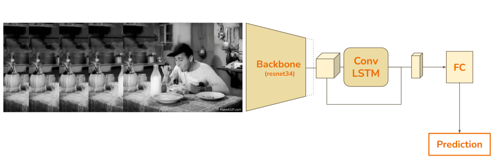

_Figure 5: Architecture of the spatio-temporal model_

## Results

In this section, we will present the results of the three different models that we have examined in our experiment. We will compare the performance of the models based on the accuracy of the predictions as well as the loss of the models , and discuss the implications of the results.

### 1. Hyperparameter Optimization

We start by performing a hyperpameter optimization in order to understand what are the parameters that suit better the performance of the model with respect to the datasbase at hand.

Knowing that the Average pooling model will be the most robust out of all the models, we will try and search for the hyperpameters of such model.

The hyperparameters that we will be optimizing are the following:

- Learning Rate: 0.01, 0.001, 0.0001
- Batch Size: 16, 32, 64
- Weight Decay: 1e-5, 1e-4, 1e-3

We will be using Stochastic Gradient Descent (SGD) as an optimizer, and we will be using the Cross Entropy Loss as a loss function.

Here are the results obtained from the hyperparameter optimization:

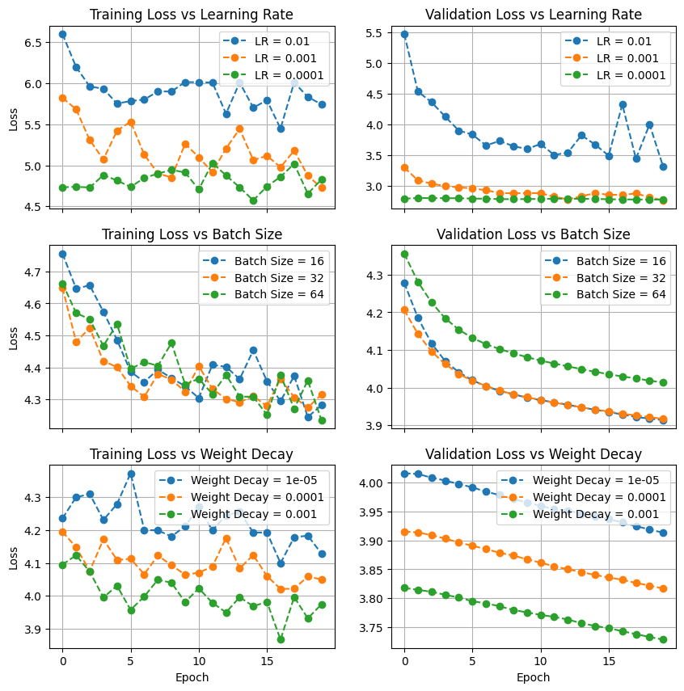

_Figure 6: Hyperparameter Optimization_

We come to the conlusion that the best hyperparameters for the Average Pooling model are the following:

- Learning Rate: 0.001
- Batch Size: 32
- Weight Decay: 1e-3

With a final tentative to optimize the hyperparameters, we combine theses parameters together and by fine-tuning we are able to obtain these final optimal hyperpameters:

- Learning Rate: 0.001
- Batch Size: 32
- Weight Decay: 5e-5

### 2. Non-Temporal Model (Average Pooling)

A primitive study on the hyperparameter optimization of the model lead us to the experimentation of the following hyperparameters:

- Learning Rate: 0.01, weight decay: 5e-5, momentum: 0.9
- Learning Rate: 0.001, weight decay: 5e-5, momentum: 0.9

We compare the loss function of the model in order to interpret the performance of the model, to be chosen.

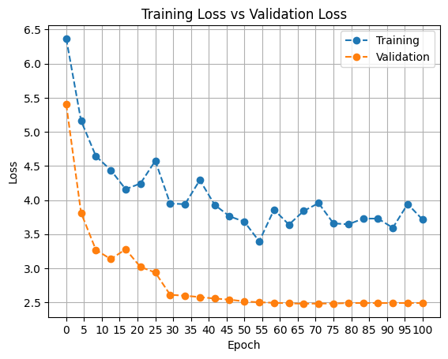

_Figure 6: Loss function of the non-temporal model with learning rate 0.01_

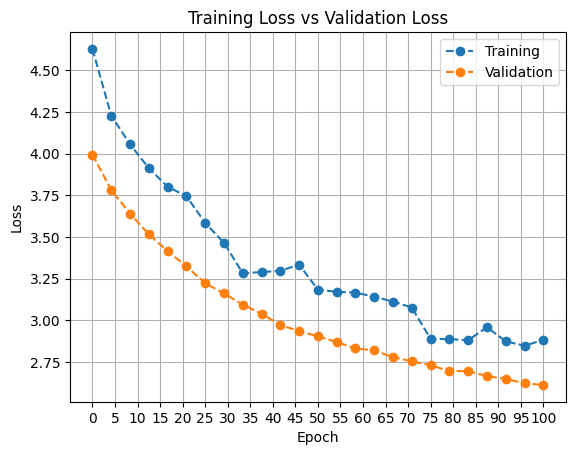

_Figure 7: Loss function of the non-temporal model with learning rate 0.001_

As first look on both graphs allow us to detect a higher loss initialization for the model with learning rate 0.01. Although the loss decreases with a more rapid slope, the loss metric then stagnates from epoch 50 onwards, which means that the model is not longer able to learn from the data, especially with a blatant oscillation in terms of the loss metric in the training phase.

On the other hand, although the loss function of the learning rate 0.001 does not reach a lower mark than the one with the learning rate 0.01, we can see a more plausible decrease in the loss metric through the epochs with the a nearly similar behavior in the training phase as well as in the validation phase. We do also reach a very satisfactory loss in the later part of the training phase, which do joins the losses that were observered previously with a learning rate of 0.01.

Such analysis allows us to consider the model with a learning rate of 0.001 as the best model to be chosen for the non-temporal model, and thus, we can study the indications of the accuracy that this model has to offer.

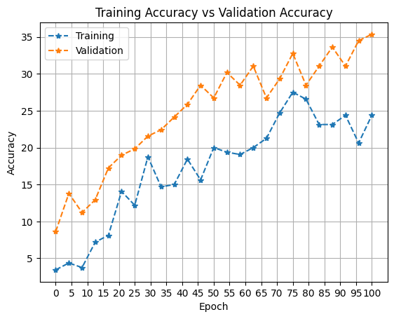

_Figure 8: Accuracy of the non-temporal model with learning rate 0.001_

The accuracy of the model with a learning rate of 0.001 is quite satisfactory, as we can see a steady increase in the accuracy metric through the epochs, with a slight oscillation in the validation phase. Although the accuracy of the model does not reach higher than a 37%, it was actually expected as video classification is not adequate for a non-temporal model that does not keep track of the temporal information of the frames that have a direct correlation to one another.

**The final accuracy** of the non-temporal model with average pooling is **34.052%**.

### 3. Temporal Model (LSTM)

We will now examine the results of the temporal model using the optimal hyperparameters that we have defined in the Non-temporal model above and they are the following:

- Learning Rate: 0.001, weight decay: 5e-5, momentum: 0.9

We compare the accuracy of the temporal model and its loss function in order to interpret the performance of the model.

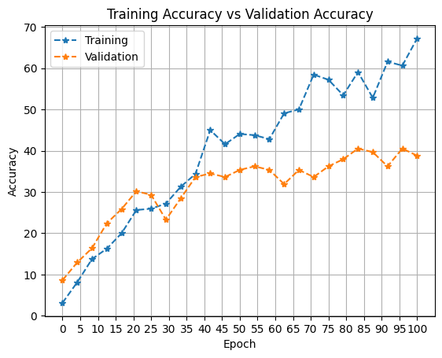

_Figure 9: Accuracy of the temporal model with learning rate 0.001_

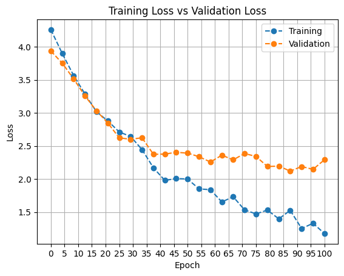

_Figure 10: Loss function of the temporal model with learning rate 0.001_

The first impression we get from the analysis of the metrics of the temporal model is a clear improvement of the accuracy of the temporal model as well as a great reduction of the loss function with respect to the metrics we have previously computed in the non-temporal model. This improvement is caused by the memory factor that is implemented within the
LSTM cell, which allows the model to keep track of the temporal information of the frames that have a direct correlation to one another.

**The final accuracy** of the temporal model with LSTM is **45.69%**.

### 4. Spatio-Temporal Model (ConvLSTM)

We will now examine the results of the spatio-temporal model using the optimal hyperparameters that we have defined previously:

- Learning Rate: 0.001, weight decay: 5e-5, momentum: 0.9

We modify, however, one hyperparameter to be added to the default list which is the step size of the ConvLSTM layer, which is set to 50, meaning that a change in the learning rate will be performed after 50% of the training has been done.

We compare the accuracy of the spatio-temporal model and its loss function in order to interpret the performance of the model.

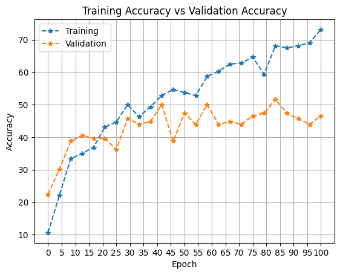

_Figure 11: Accuracy of the spatio-temporal model with learning rate 0.001_

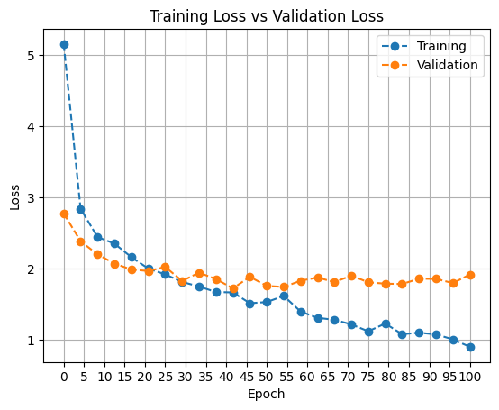

_Figure 12: Loss function of the spatio-temporal model with learning rate 0.001_

The performance deduced from the ConvLSTM model betters the results already seen in the previous models.
In fact, the accuracy of the model is the highest among the three models and the gap between the model in the training and validation phases are reduced with respect to the previous models.

We do confidently achieve the following results with respect to the previous models:

- Higher accuracy in the training phase.
- Higher accuracy in the validation phase.
- Lower loss in the training phase.
- Lower loss in the validation phase.

**The final accuracy** of the spatio-temporal model with ConvLSTM is **48.28%**.

## Conclusion

Based on the previous results shown, we can clearly notice that the consideration of the spatial and temporal information of the dataset,
seemed the most logical and accuracte choice while training a recurrent model.

We also can deduce, the importance of having a memory of previous actions and it is considered important in the classification of videos, as the temporal information is crucial in the classification of the actions.

## Class Activation Maps (CAM)

A Class Activation map for a particular category indicates the particular region used by CNN to identify the output class.

The CNN model is composed of numerous convolutionary layers and we perform global average pooling just before the final output layer. To get the desired output, the resulting features are fed to a fully connected layer with softmax activation. By projecting the output layer weights back into the convolutionary maps derived from the last Convolution Layer the importance of the image regions is identifiable. This technique is referred to as _Class Activation Mapping_.

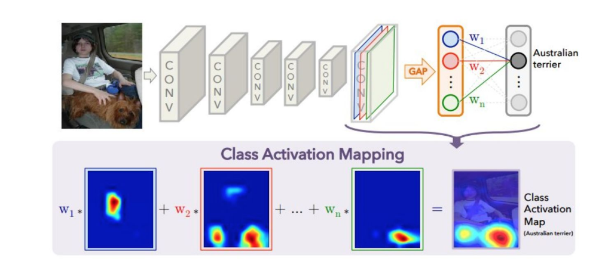

_Figure 13: Class Activation Maps (CAM)_

We perform a Class Activation Map on our testing set in order to visualize the regions our model is able to use.

We extract 5 sequential pictures with their respective actimvation maps and we observe the following results:

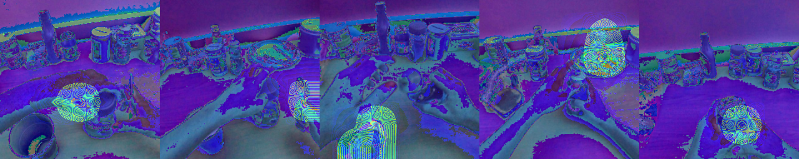

_Figure 14: Class Activation Maps (CAM) Results_

The fuzzy area represents the class activations of each picture, and we can see that the convolutional model follows the gestures of the hands or at least the
region that localize the hands, as he deemed it as the most important region to classify the action.

## References

- [1] Dataset - [GTEA61](http://cbs.ic.gatech.edu/egocentric/index.html)

- [2] He, K., Zhang, X., Ren, S., & Sun, J. (2015). Deep Residual Learning for Image Recognition. arXiv preprint arXiv:1512.04150 - [paper](https://arxiv.org/abs/1512.04150)

- [3] Hochreiter, S., & Schmidhuber, J. (1997). Long short-term memory. Neural computation, 9(8), 1735-1780 - [paper](https://www.mitpressjournals.org/doi/abs/10.1162/neco.1997.9.8.1735)

- [4] Xingjian, S. H. I., Chen, Z., Wang, H., Yeung, D. Y., Wong, W. K., & Woo, W. C. (2015). Convolutional LSTM network: A machine learning approach for precipitation nowcasting. In Advances in neural information processing systems (pp. 802-810) - [paper](https://arxiv.org/abs/1506.04214)
